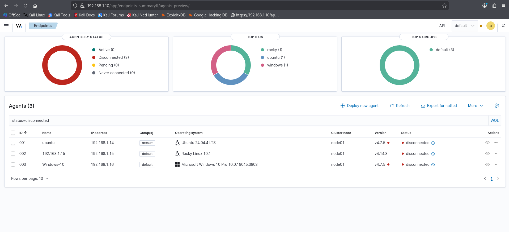
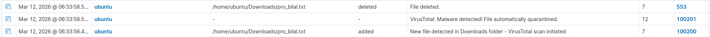
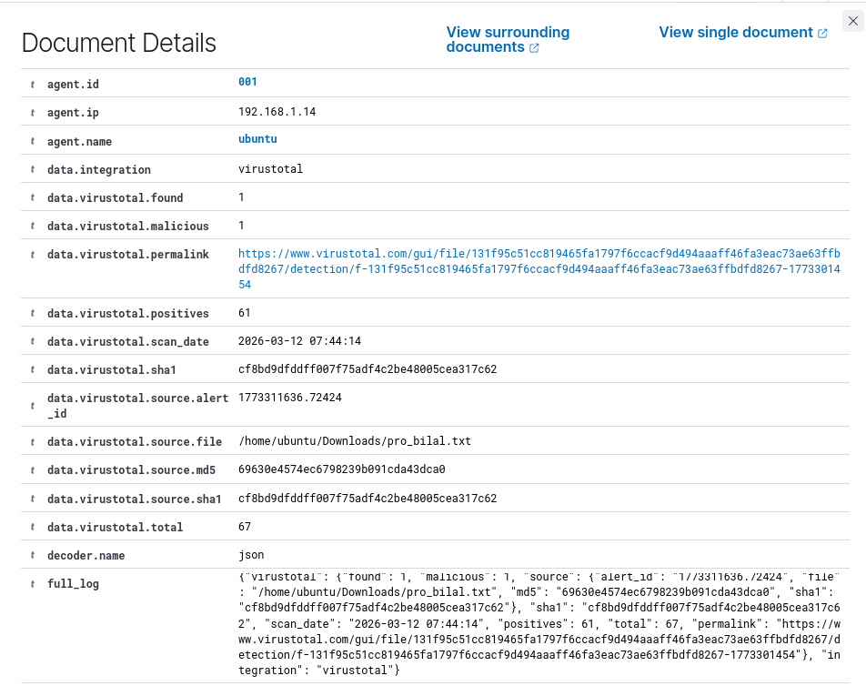
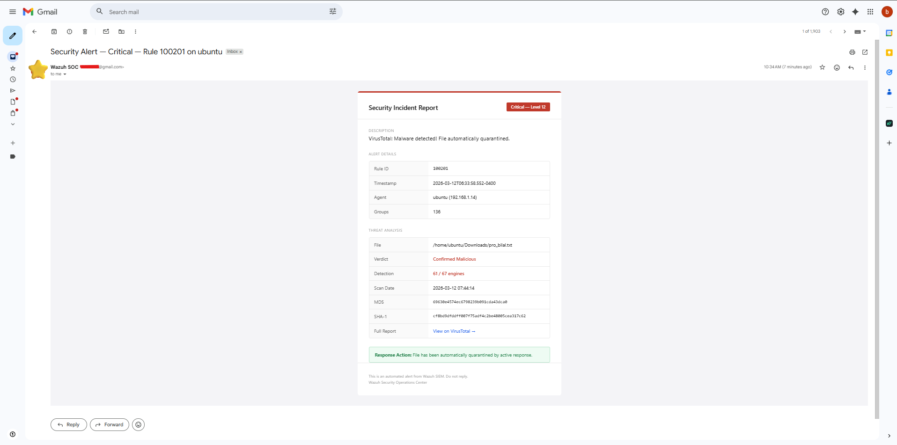
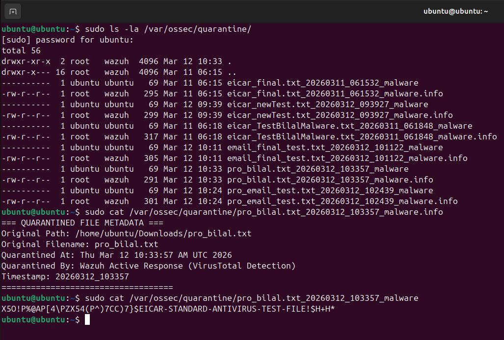

# Automated Malware Detection and Quarantine System

A security operations platform that detects, analyzes, and quarantines malware in real time using Wazuh SIEM, VirusTotal API, and automated incident response with email notification.

---

## Architecture

```
Wazuh Manager (Kali Linux)
├── VirusTotal Integration
├── Active Response Engine
├── Email Alert System (Postfix + Gmail SMTP)
│
├── Agent 001 — Ubuntu Desktop 24.04
├── Agent 002 — Rocky Linux
└── Agent 003 — Windows 10
```

### Lab Environment



**Detection pipeline:**

```
File created in monitored directory
  → FIM detects new file (Rule 554)
  → Custom rule triggers VirusTotal scan (Rule 100200)
  → VirusTotal confirms malware (Rule 87105)
  → Custom rule triggers response (Rule 100201)
  → Active response quarantines file
  → HTML email alert sent to analyst
```

Average time from file creation to quarantine: under 60 seconds.

---

## Components

### Custom Detection Rules

| Rule ID | Level | Description |
|---------|-------|-------------|
| 100200 | 7 | New file in Downloads folder — triggers VirusTotal scan |
| 100201 | 12 | VirusTotal confirms malware — triggers quarantine and email |

### Active Response Script

`remove-threat.sh` runs on the agent when Rule 100201 fires. It extracts the file path from the Wazuh alert JSON, moves the file to a quarantine directory, sets restrictive permissions, and writes forensic metadata.

**Challenge solved:** Wazuh embeds raw JSON inside the `full_log` field with unescaped quotes, which breaks `jq` parsing. The script uses `grep -oP` with Perl regex instead.

### Email Alert Integration

`custom-email-alert.sh` runs on the manager as a Wazuh integration. It parses the alert JSON, builds an HTML email with incident details and VirusTotal analysis data, and sends it through Postfix configured as a Gmail SMTP relay.

---

## Results

### Dashboard — Alert Overview



### Dashboard — Alert Details



### Professional HTML Email Alert



### File Quarantined Successfully



---

## Setup

### Prerequisites

- Kali Linux (or Debian-based) as Wazuh Manager with 8GB+ RAM
- One or more agent VMs (Ubuntu, Rocky Linux, Windows)
- VirusTotal API key (free tier works)
- Gmail account with App Password enabled

### 1. Deploy custom rules

Copy `configs/local_rules.xml` to `/var/ossec/etc/rules/` on the manager.

### 2. Configure VirusTotal integration

Add the integration block to `/var/ossec/etc/ossec.conf` on the manager:

```xml
<integration>
  <name>virustotal</name>
  <api_key>YOUR_API_KEY</api_key>
  <rule_id>100200</rule_id>
  <alert_format>json</alert_format>
</integration>
```

### 3. Deploy active response script

Copy `scripts/remove-threat.sh` to `/var/ossec/active-response/bin/` on each agent.

```bash
chmod 750 /var/ossec/active-response/bin/remove-threat.sh
chown root:wazuh /var/ossec/active-response/bin/remove-threat.sh
```

### 4. Configure email alerting

Install Postfix on the manager and configure it as a Gmail relay. Then copy `scripts/custom-email-alert.sh` to `/var/ossec/integrations/` on the manager.

See [docs/email-setup.md](docs/email-setup.md) for step-by-step instructions.

### 5. Configure FIM on agent

Ensure the agent `ossec.conf` monitors the Downloads directory in realtime:

```xml
<directories realtime="yes" check_all="yes">/home/ubuntu/Downloads</directories>
```

### 6. Restart services

```bash
sudo systemctl restart wazuh-manager
sudo systemctl restart wazuh-agent
```

---

## Testing

Drop an EICAR test file on any monitored agent:

```bash
cd ~/Downloads
echo 'X5O!P%@AP[4\PZX54(P^)7CC)7}$EICAR-STANDARD-ANTIVIRUS-TEST-FILE!$H+H*' > test.txt
```

Expected results:

- File quarantined to `/var/ossec/quarantine/` within 60 seconds
- Email alert received with VirusTotal analysis (61/67 engines detecting)
- Alert visible in Wazuh dashboard as Rule 100201, Level 12

---

## Problems Solved

| Problem | Cause | Solution |
|---------|-------|----------|
| Active response received empty file path | Wazuh JSON contains unescaped nested JSON in `full_log` that breaks `jq` | Used `grep -oP` regex extraction instead of `jq` |
| Quarantine never triggered despite VirusTotal detecting malware | Rule 100203 overrode Rule 100201 at lower severity, preventing active response | Removed conflicting rule |
| Test files not flagged by VirusTotal | Custom text files have unique hashes not in any database | Used EICAR standard test string which all engines recognize |
| Default Wazuh email is unformatted raw JSON | Built-in mail module has no HTML support | Built custom integration script with HTML email template |

---

## Repository Structure

```
├── README.md
├── LICENSE
├── configs/
│   ├── local_rules.xml
│   └── ossec-manager.conf.sample
├── scripts/
│   ├── remove-threat.sh
│   └── custom-email-alert.sh
├── docs/
│   └── email-setup.md
└── screenshots/
    ├── Machines.png
    ├── dashboard-alert.png
    ├── dashboard-alert-details.png
    ├── email-alert.png
    └── quarantine.png
```

---

## Technologies

- Wazuh 4.7.5
- VirusTotal API
- Postfix (Gmail SMTP relay)
- Bash
- OpenSearch / Wazuh Dashboard
- Ubuntu 24.04, Rocky Linux, Windows 10, Kali Linux

---

## License

MIT
